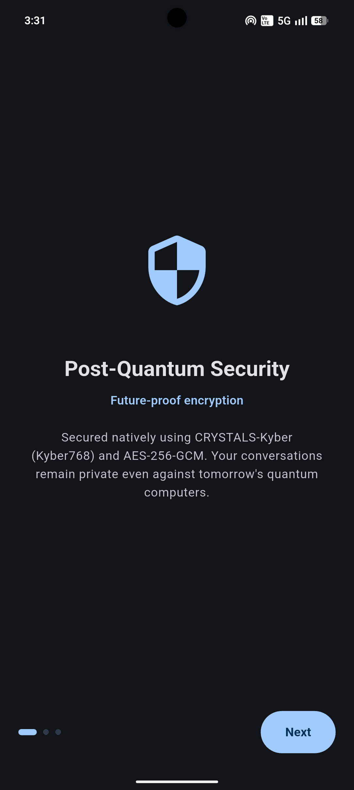
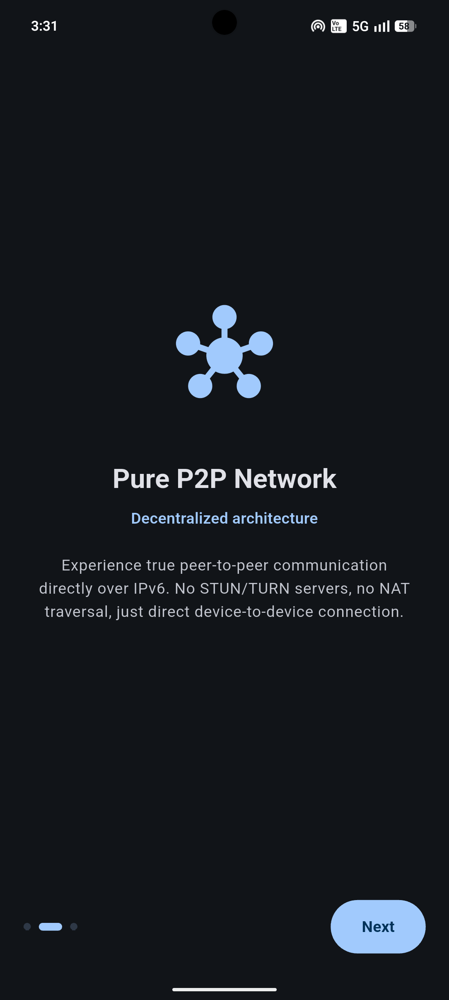
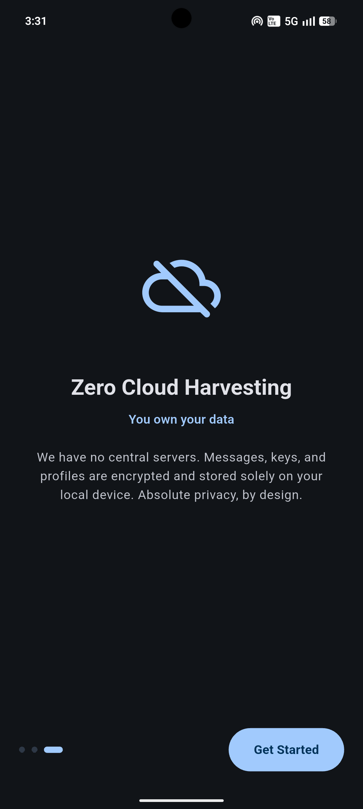
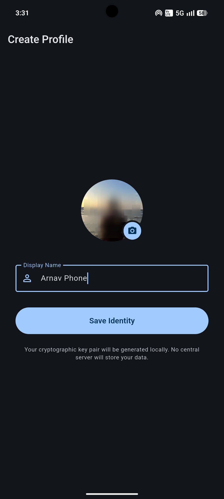
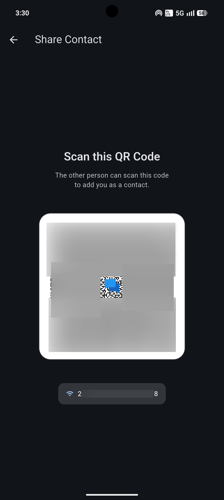
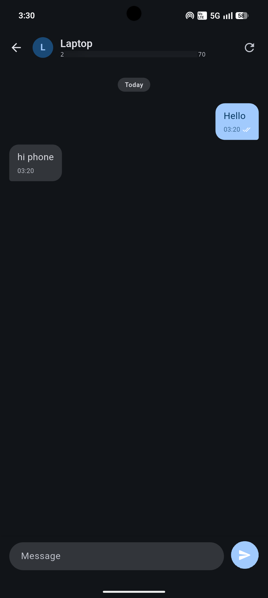

<div align="center">

<h1>
  
  <span style="font-size:1.5em; vertical-align:middle; margin-left:8px;">Quantum</span>
</h1>

### Post-Quantum Secure · Pure IPv6 P2P · Zero Cloud

*A serverless, end-to-end encrypted messaging app built with Flutter*

[](https://flutter.dev)
[](https://dart.dev)
[](LICENSE)
[](https://github.com)
---
</div>


## What is Quantum?

Quantum is a **fully serverless, peer-to-peer messaging application** that routes all communication directly between devices over native IPv6 TCP, no STUN servers, no relay nodes, no cloud infrastructure, no accounts.

Messages are end-to-end encrypted using **CRYSTALS-Kyber768** for post-quantum key exchange and **AES-256-GCM** for symmetric confidentiality. Every cryptographic operation happens locally. Nothing leaves your device unencrypted, and no third party ever sees your keys, messages, or contact list.

---

<div align="center">
  
  
  
  
  
  
</div>


---

## Why Post-Quantum?

Classical key exchange algorithms (RSA, ECDH) are broken by Shor's algorithm on a sufficiently powerful quantum computer. The **"harvest now, decrypt later"** attack, where adversaries archive today's traffic to decrypt once quantum hardware matures, is already a credible concern. Quantum uses **CRYSTALS-Kyber (NIST FIPS 203)**, a lattice-based KEM proven hard for both classical and quantum computers, ensuring your conversations remain private long-term.

---

## Features

| | Feature | Status |
|---|---|---|
| 🌐 | **Pure TCP/IPv6 P2P**, Direct device links, no intermediaries | ✅ |
| 🔐 | **Kyber768 Key Exchange**, NIST post-quantum KEM | ✅ |
| 🔒 | **AES-256-GCM Encryption**, Authenticated symmetric encryption | ✅ |
| 📱 | **Onboarding Flow**, Animated first-launch introduction | ✅ |
| 👤 | **Local Identity**, Name + avatar, key pair generated on-device | ✅ |
| 📷 | **QR Code Contact Exchange**, Scan to add contacts | ✅ |
| 💬 | **Real-time Messaging**, With sent/delivered/read receipts | ✅ |
| 🎨 | **Material 3 Design**, Flat, clean UI with light & dark mode | ✅ |
| 💾 | **Local-Only Storage**, Hive database, no cloud sync ever | ✅ |
| 🔔 | **Push Notifications** | 🔧 In Progress |
| ⚙️ | **Settings Screen**, Theme toggle, profile edit, app preferences | 📋 Planned |
| 🖼️ | **File & Media Sharing**, Encrypted image/file transfer over P2P | 📋 Planned |
| 👥 | **Group Chats**, Decentralized multi-party conversations | 📋 Planned |
| 📞 | **Voice / Video Calls**, Direct P2P WebRTC or raw RTP calls | 📋 Planned |
| 🌍 | **Remote Discovery Ledger**, Private IP discovery without leakage | 📋 Planned |
| 🧅 | **Tor Routing**, Optional onion routing for enhanced anonymity | 📋 Planned |

---

## Architecture

### 🌐 P2PService, TCP over IPv6

Every app instance runs both a server and a client simultaneously:

- A `ServerSocket` binds to `[::]:8888` to accept incoming connections from peers.
- Outbound connections are established via `Socket.connect` targeting the peer's global unicast IPv6 address.
- All payloads are **newline-framed JSON** over persistent TCP streams, ensuring ordered, reliable delivery.
- On network change events (Wi-Fi switch, reconnect), the service re-discovers the device's IPv6 address, closes all stale sockets, and re-initiates handshakes with all known contacts.

### 🔐 EncryptionService, Post-Quantum E2E

**Key exchange (Kyber768):**
On first contact, one party encapsulates a shared secret using the peer's public key. The resulting ciphertext is transmitted; the recipient decapsulates to derive the same 256-bit shared secret. A **tie-breaking protocol** based on lexicographic public key comparison ensures only one side initiates the KEM, preventing race conditions when both devices connect simultaneously.

**Message encryption (AES-256-GCM):**
All messages are encrypted with the derived shared secret. GCM mode provides both confidentiality and tamper-evidence with an authenticated tag.

### 💾 StorageService, Hive Local DB

All data is stored on-device in isolated Hive boxes:

| Box | Contents |
|---|---|
| `profileBox` | Display name, avatar path, Kyber key pair, IPv6 address |
| `contactsBox` | Peer names, public keys, IP addresses, derived shared secrets |
| `messagesBox` | Full message history, timestamps, delivery status |
| `settingsBox` | Onboarding seen flag, theme preferences, app config |

---

## How Messaging Works

```
Device A (Initiator)                     Device B (Recipient)
────────────────────                     ────────────────────
1. Scan B's QR code            ──►       B's public key + IPv6 stored
2. TCP connect to B:8888       ──►       ServerSocket accepts
3. Send plain handshake        ──►       _handleHandshake()
4. Kyber768.encapsulate(B.pk)            Kyber768.decapsulate(ciphertext)
   sharedSecret_A  ←identical→           sharedSecret_B
5. AES256GCM.encrypt(msg)      ──►       AES256GCM.decrypt(msg)
6. Receive delivery_ack        ◄──       Send delivery_ack
7. Receive read_ack            ◄──       Send read_ack (on chat open)
```

---

## Project Structure

```
quantum/
├── lib/
│   ├── main.dart                        # Boot, theming, routing logic
│   ├── models/
│   │   ├── contact.dart
│   │   ├── message.dart
│   │   └── profile.dart
│   ├── services/
│   │   ├── p2p_service.dart             # TCP socket server + client
│   │   ├── encryption_service.dart      # Kyber768 + AES-256-GCM
│   │   ├── storage_service.dart         # Hive DB operations
│   │   └── notification_service.dart   # Local push notifications
│   └── screens/
│       ├── onboarding_screen.dart       # First-launch carousel
│       ├── profile_setup_screen.dart    # Identity creation
│       ├── chats_home_screen.dart       # Conversation list
│       ├── chat_room_screen.dart        # Individual chat UI
│       ├── share_contact_screen.dart    # QR code generator
│       └── add_contact_screen.dart      # QR code scanner
├── android/
└── pubspec.yaml
```

---

## Getting Started

### Prerequisites
- Flutter SDK `>=3.0.0`
- Android SDK (API 21+) or a Linux desktop
- Both devices must share **IPv6 connectivity** (same LAN with IPv6 SLAAC, or public IPv6)

### Install & Run

```bash
# 1. Install dependencies
flutter pub get

# 2. Generate Hive type adapters
flutter pub run build_runner build --delete-conflicting-outputs

# 3. Run (Android via USB)
flutter run

# 3. Or run on Linux desktop
flutter run -d linux

# 3. Or build release APK
flutter build apk
```

---

## Security Model

| Layer | Algorithm | Standard |
|---|---|---|
| Key Exchange | CRYSTALS-Kyber768 | NIST FIPS 203 |
| Symmetric Encryption | AES-256-GCM | NIST FIPS 197 |
| Shared Secret Size | 256 bits |, |
| Nonce | 96-bit random, per-message |, |

> **Alpha Disclaimer:** The cryptographic foundations are solid. Forward secrecy (double-ratchet) and peer authentication via key fingerprints are on the roadmap.

---

## Network Requirements

- Both devices need a **global unicast IPv6 address** (not `fe80::` link-local, not `::1` loopback)
- Firewall must allow **inbound + outbound TCP on port 8888**
- Works on the same LAN (IPv6 router advertisement required) or across networks with publicly routed IPv6

### Common Connection Errors

| Error | Cause | Fix |
|---|---|---|
| `Connection refused (errno 111)` | Remote app not running or not yet listening | Start Quantum on both devices before scanning |
| `Permission denied (errno 13)` | Android blocking outbound raw socket | Ensure `INTERNET` permission is in `AndroidManifest.xml` |
| `No route to host (errno 113)` | IPv6 routing broken between devices | Check router has RA/SLAAC enabled; verify same subnet |
| QR scan not working on Linux | `mobile_scanner` requires Android/iOS native | Use an Android device for scanning |

---

## Roadmap

### 🔧 Short-Term (In Progress)
- [ ] Fix background push notifications on Android
- [ ] Code cleanup, remove dead code, improve inline documentation
- [ ] Real-time IP and QR refresh on network interface changes
- [ ] TCP reconnect with exponential backoff

### 🎨 UI / UX
- [ ] **Settings Screen**, Manual theme toggle (light/dark/system), profile editing, app info
- [ ] **Theme Persistence**, Store and restore user's preferred theme across sessions
- [ ] **Contact Detail Screen**, View contact info, public key fingerprint, connection status
- [ ] **Swipe to Reply**, Contextual message quoting
- [ ] **Emoji Reactions**, Lightweight reaction protocol over P2P

### 📡 Protocol Enhancements
- [ ] **Encrypted File & Image Sharing**, Stream encrypted binary blobs over the existing TCP session
- [ ] **Group Chats**, Decentralized multi-party protocol; mesh key distribution
- [ ] **Voice Calls**, Direct P2P audio stream over IPv6 (WebRTC or raw RTP)
- [ ] **Video Calls**, Direct P2P video over IPv6
- [ ] **Message Reactions & Editing**, Protocol-level message mutation support
- [ ] **Forward Secrecy**, Double-ratchet algorithm on top of the Kyber-derived root key
- [ ] **Key Fingerprint Verification**, In-app fingerprint for security

### 🌍 Discovery & Privacy
- [ ] **Decentralized Discovery Ledger**, Each peer publishes `Encrypt(theirIP, yourPublicKey)` to a shared append-only ledger. Only the intended recipient can decrypt the address. Eliminates IP leak in QR codes and enables remote discovery without a central directory.
- [ ] **Dynamic Per-Contact Key Derivation**, Each contact relationship uses a unique key derivative. Enables authorized contact-graph tracing (e.g., "introduced by") while preserving external anonymity.
- [ ] **Tor / I2P Routing**, Optional routing layer for enhanced anonymity when IPv6 reachability is undesirable.

### 📱 Platform
- [ ] **iOS Support**, Port and test on iOS (networking, camera scanner)
- [ ] **Windows / macOS Desktop**, Platform-native builds
- [ ] **SIM-Bound Identity (Mobile Only)**, Optional 6-character alphanumeric ID derived from SIM for human-readable addressing, without requiring a central account system

---

## Contributing

Pull requests, issues, and feature suggestions are welcome. Please open an issue before submitting large changes.

---

## License

MIT License, see [LICENSE](LICENSE) for details.

---

<div align="center">
  Built with Flutter · No servers, no compromises.
</div>
